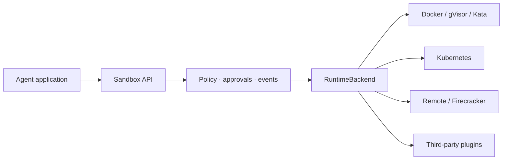

<p align="center">
  
</p>

<h1 align="center">AgentNest</h1>

<p align="center"><strong>The open-source runtime for secure AI agent execution.</strong></p>

<p align="center">
  <a href="https://github.com/mihirahuja1/agentnestOSS/actions"></a>
  <a href="https://pypi.org/project/agentnest/"></a>
  <a href="LICENSE"></a>
</p>

AgentNest gives AI agents disposable, policy-controlled environments for Python, shell commands,
files, packages, browsers, GPUs, and Git work. It is self-hosted, Python-first, and deliberately not
another cloud or cluster orchestrator.

```python
from agentnest import Sandbox

with Sandbox("python:3.12-slim", timeout=60) as sandbox:
    sandbox.write_file("main.py", "print('Hello from isolation')")
    result = sandbox.exec_shell("python main.py")
    print(result.stdout)
```

## Why AgentNest

- **Secure defaults:** non-root, read-only root, no capabilities, denied networking, limits, cleanup
- **Backend-independent:** Docker, gVisor, Kata, Kubernetes, remote workers, Firecracker transport
- **Agent-native:** async, streaming, secrets, approvals, audit events, snapshots, pools, artifacts
- **Self-hosted:** one Docker installation locally; your own nodes and policies in production
- **Extensible:** third-party runtime plugins through standard Python entry points

> [!WARNING]
> Containers share the host kernel. Choose an isolation boundary appropriate for your threat model.
> Read the [security model](docs/security.md) before running hostile multi-tenant workloads.

## Install

```bash
pip install agentnest
agentnest doctor
```

Optional extras:

```bash
pip install 'agentnest[kubernetes]'
pip install 'agentnest[server]'
pip install 'agentnest[mcp]'
pip install 'agentnest[all]'
```

## Capabilities

```python
from agentnest import NetworkPolicy, Sandbox, Secret, SecurityPolicy

policy = SecurityPolicy(
    network=NetworkPolicy.denied(),
    max_output_bytes=2_000_000,
    require_image_digest=True,
)

with Sandbox(
    "python@sha256:<digest>",
    security_policy=policy,
    environment={"TOKEN": Secret("redacted-in-output")},
    memory="512m",
    cpus=1.0,
) as sandbox:
    for event in sandbox.stream_shell("python main.py"):
        print(event.data, end="")

    checkpoint = sandbox.snapshot("workspace.tar")
    for artifact in sandbox.artifacts("output/**/*"):
        print(artifact.path, artifact.sha256)
```

Also included: `AsyncSandbox`, deterministic `Template` builds, bounded `SandboxPool`, Git workspace
helpers, browser/GPU presets, MCP tools, YAML profiles, a CLI, and an authenticated remote API.

## Architecture



Read the [quickstart](docs/quickstart.md), [architecture](docs/architecture.md), [deployment guide](docs/deployment.md), and complete [documentation](docs/index.md).

## Development

```bash
pip install -e '.[dev,docs]'
ruff check .
ruff format --check .
mypy agentnest
pytest --cov=agentnest --cov-report=term-missing
mkdocs build --strict
```

Docker integration tests are opt-in:

```bash
AGENTNEST_DOCKER_TESTS=1 pytest -m integration
```

Apache License 2.0. See [LICENSE](LICENSE).
