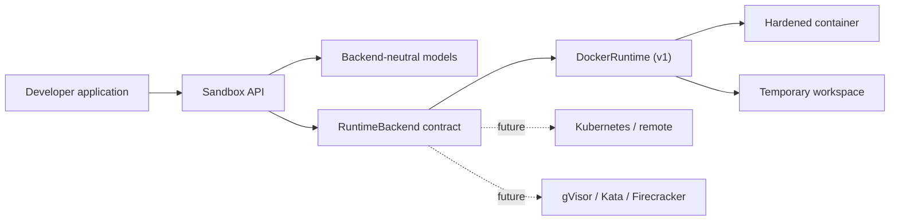

# AgentNest

AgentNest is an open-source Python runtime for secure, isolated AI agent execution. It gives
applications a small, backend-independent API for running Python and shell code, exchanging
files, collecting output, and reliably destroying the environment afterward.

Docker is the v1 backend. The architecture deliberately keeps Docker below a runtime contract so
gVisor, Kata Containers, Firecracker, Kubernetes, and remote workers can be added without changing
application code.

> [!WARNING]
> AgentNest is early-stage software. Containers are a useful isolation boundary, not a universal
> security boundary. Evaluate Docker, the host kernel, image provenance, and your threat model
> before running hostile code in production. See [Security](docs/security.md).

## Quick start

Requirements: Python 3.10+ and a running Docker daemon.

```bash
python -m venv .venv
source .venv/bin/activate
pip install -e .
```

```python
from agentnest import Sandbox

with Sandbox(runtime="python:3.12-slim", timeout=300) as sandbox:
    sandbox.write_file("main.py", "print('Hello from AgentNest')")

    python = sandbox.exec_python("print(6 * 7)")
    shell = sandbox.exec_shell("python main.py")

    print(python.stdout)       # 42
    print(shell.stdout)        # Hello from AgentNest
    print(sandbox.logs())
```

The context manager is recommended. Calling `sandbox.destroy()` directly is also safe and
idempotent.

## API

```python
sandbox = Sandbox(
    runtime="python:3.12-slim",
    timeout=300,
    environment={"MODE": "analysis"},
    workdir="/workspace",
    network_enabled=False,
    memory="512m",
    cpus=1.0,
    pids=256,
)

result = sandbox.exec_python("print('hello')", timeout=10)
result = sandbox.exec_shell("pip install requests && python main.py", timeout=120)

sandbox.write_file("config.json", '{"enabled": true}')
text = sandbox.read_file("config.json")
binary = sandbox.read_file("artifact.bin", encoding=None)
sandbox.upload_file("./local-input.csv", "input.csv")
sandbox.download_file("result.csv", "./result.csv")

print(result.exit_code, result.stdout, result.stderr, result.duration)
result.check()  # raises ExecutionError for a non-zero exit code
sandbox.destroy()
```

Workspace paths are always relative and cannot traverse outside `/workspace`. Per-command
environment variables and working directories are supported. A working directory must remain
beneath `/workspace`.

Networking is disabled by default. Enable it only for workloads that need package downloads or
external services:

```python
with Sandbox("python:3.12-slim", network_enabled=True) as sandbox:
    sandbox.exec_shell("pip install requests")
```

Python images automatically install non-root user packages under the temporary workspace. The
workspace disappears when the sandbox is destroyed.

## Security defaults

- fixed non-root UID/GID (`65532`)
- no privileged mode, Linux capabilities dropped, and `no-new-privileges`
- read-only container root filesystem with small, restricted `/tmp` and `/run` mounts
- networking disabled unless explicitly enabled
- CPU, memory, and process limits
- unguessable, per-sandbox temporary workspace; no arbitrary host mounts
- command and total-lifetime deadlines; timeout destroys the container
- forced container and workspace cleanup

These controls are defense in depth. The process hosting AgentNest can access the Docker daemon
and must itself be trusted.

## Architecture



See [Architecture](docs/architecture.md) for lifecycle and extension details.

## Development

```bash
pip install -e '.[dev]'
ruff check .
mypy agentnest
pytest --cov=agentnest --cov-report=term-missing
AGENTNEST_DOCKER_TESTS=1 pytest -m integration
```

Alternatively, `docker compose run --rm test` runs the full suite with the local Docker daemon.
Mounting the Docker socket gives the development container daemon-level host access; use this only
on a trusted development machine.

Read the [Development guide](docs/development.md), browse [examples](examples), and review the
[roadmap](docs/architecture.md#roadmap).

## License

Apache License 2.0. See [LICENSE](LICENSE).

