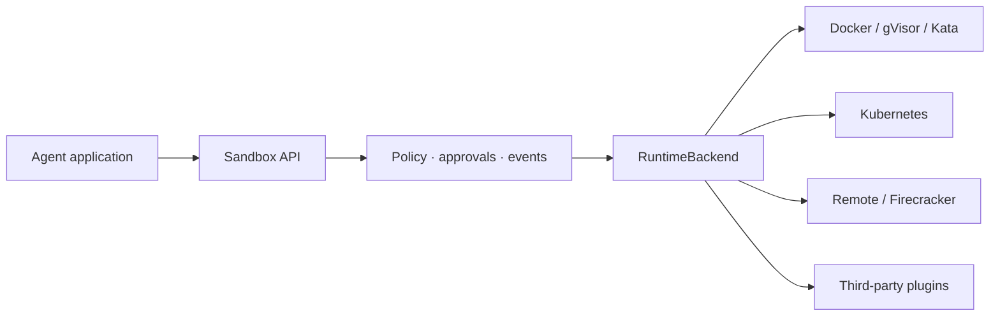

<p align="center">
  
</p>

<h1 align="center">AgentNest</h1>

<p align="center"><strong>The open-source runtime for secure AI agent execution.</strong></p>

<p align="center">
  <a href="https://github.com/mihirahuja1/agentnestOSS/actions"></a>
  <a href="https://pypi.org/project/agentnest/"></a>
  <a href="LICENSE"></a>
</p>

AgentNest gives AI agents disposable, policy-controlled environments for Python, shell commands,
files, packages, browsers, GPUs, and Git work. It is self-hosted, Python-first, and deliberately not
another cloud or cluster orchestrator.

```python
from agentnest import Sandbox

with Sandbox("python:3.12-slim", timeout=60) as sandbox:
    sandbox.write_file("main.py", "print('Hello from isolation')")
    result = sandbox.exec_shell("python main.py")
    print(result.stdout)
```

## Why AgentNest

- **Secure defaults:** non-root, read-only root, no capabilities, denied networking, limits, cleanup
- **Egress allowlisting:** let code reach `pypi.org` and nothing else, with every connection logged
- **Agent-native:** stateful Python sessions, forkable state, async, streaming, secrets, approvals, audit events
- **Non-destructive timeouts:** a slow command is killed on its own; the sandbox and its state survive
- **Crash-safe:** every resource is labelled with a deadline, so `agentnest prune` reaps orphans
- **Proven, not promised:** a [suite of escape attempts](tests/escapes) runs on every commit
- **Self-hosted & extensible:** your Docker or Kubernetes; third-party backends via entry points

Try it in one command (needs Docker):

```bash
pip install agentnest
agentnest demo
```

> [!WARNING]
> Containers share the host kernel. Choose an isolation boundary appropriate for your threat model.
> Read the [security model](docs/security.md) before running hostile multi-tenant workloads.

## Install

```bash
pip install agentnest
agentnest doctor
```

Optional extras:

```bash
pip install 'agentnest[kubernetes]'
pip install 'agentnest[server]'
pip install 'agentnest[mcp]'
pip install 'agentnest[all]'
```

## Capabilities

```python
from agentnest import NetworkPolicy, Sandbox, Secret, SecurityPolicy

policy = SecurityPolicy(
    network=NetworkPolicy.denied(),
    max_output_bytes=2_000_000,
    require_image_digest=True,
)

with Sandbox(
    "python@sha256:<digest>",
    security_policy=policy,
    environment={"TOKEN": Secret("redacted-in-output")},
    memory="512m",
    cpus=1.0,
) as sandbox:
    for event in sandbox.stream_shell("python main.py"):
        print(event.data, end="")

    checkpoint = sandbox.snapshot("workspace.tar")
    for artifact in sandbox.artifacts("output/**/*"):
        print(artifact.path, artifact.sha256)
```

### Egress allowlisting

Give code the network it needs and nothing more. Denied is still the default;
an allowlist routes traffic through a filtering proxy that only lets approved
domains through.

```python
from agentnest import NetworkPolicy, Sandbox, SecurityPolicy

policy = SecurityPolicy(network=NetworkPolicy.allowlist(domains=("pypi.org", "files.pythonhosted.org")))
with Sandbox("python:3.12-slim", security_policy=policy) as sandbox:
    sandbox.exec_shell("pip install --user requests").check()   # reaches PyPI
    blocked = sandbox.exec_python("import urllib.request; urllib.request.urlopen('https://evil.example')")
    assert not blocked.ok                                       # everything else is refused
```

### Stateful sessions

A persistent interpreter keeps variables and imports across calls — the code
interpreter model, self-hosted.

```python
with Sandbox("python:3.12-slim") as sandbox:
    session = sandbox.python_session()
    session.run("import pandas as pd; df = pd.DataFrame({'x': [1, 2, 3]})")
    print(session.run("df['x'].sum()").check().result)   # -> 6
```

### Forkable sandboxes

Branch a running sandbox's state, explore several continuations, keep the one
that worked — parallel A/B attempts and agent tree search without re-running
from scratch.

```python
with Sandbox("python:3.12-slim") as base:
    base.write_file("state.json", "{}")
    attempt_a = base.fork()
    attempt_b = base.fork()   # independent copies; neither sees the other's writes
```

Also included: `AsyncSandbox`, deterministic `Template` builds, bounded `SandboxPool`, Git workspace
helpers, browser/GPU presets, MCP tools, YAML profiles, a CLI, and an authenticated remote API.

## How it compares

AgentNest is an open-source control and policy layer for infrastructure you
operate. It does not try to replace the isolation technology underneath it or
provide a hosted compute cloud.

| Project | Operating model | Isolation layer | Primary focus |
| --- | --- | --- | --- |
| **AgentNest** | Open-source Python library; runs on your Docker or Kubernetes infrastructure | Backend-dependent; Docker by default, with stronger OCI runtimes available | A consistent API for execution, policy, lifecycle management, approvals, and audit events |
| [E2B](https://e2b.dev/) | Managed service, with enterprise BYOC, on-premises, and self-hosted options | Firecracker microVMs | Managed agent sandboxes, templates, and cloud infrastructure |
| [Modal Sandboxes](https://modal.com/docs/guide/sandboxes) | Managed cloud service | gVisor by default, with a VM runtime in beta | Sandboxes integrated with Modal's broader compute platform |
| [microsandbox](https://github.com/zerocore-ai/microsandbox) | Open-source, embedded local runtime | Hardware-isolated microVMs | Fast local microVMs without a separate server or long-running daemon |

This is a positioning summary, not an exhaustive feature matrix; these projects
evolve quickly. In particular, AgentNest's default Docker backend does **not**
provide the same isolation boundary as a Firecracker or hardware-isolated
microVM because containers share the host kernel. For hostile multi-tenant code,
select a stronger runtime such as gVisor or Kata Containers and validate it
against your threat model.

See [benchmarks](docs/benchmarks.md) for measured cold-start and round-trip latencies.

## Agent frameworks and MCP

Give an existing agent a sandboxed code tool without changing its security story:

```python
from agentnest.integrations.langchain import build_langchain_tool

tool = build_langchain_tool(network_enabled=False)   # a LangChain StructuredTool
```

There is a smolagents executor and a framework-neutral `SandboxRunner` too. Or
expose AgentNest over the Model Context Protocol so Claude Code, Cursor, or
Claude Desktop can run code safely in one line of config:

```json
{ "mcpServers": { "agentnest": { "command": "agentnest", "args": ["mcp"] } } }
```

See the [integration guide](docs/guides/integrations.md).

## Architecture



Read the [quickstart](docs/quickstart.md), [architecture](docs/architecture.md), [deployment guide](docs/deployment.md), and complete [documentation](docs/index.md).

## Roadmap

### Self-hosted sandbox manager

Planned: an optional service for teams that need to run many sandboxes at once. Applications will
send it a sandbox request, and the manager will create, track, and delete the temporary environments
on the team's existing Kubernetes cluster.

The manager will provide:

- Queues and per-user limits so one application cannot consume every available resource
- Automatic cleanup if an application disconnects or crashes
- A dedicated Kubernetes namespace for sandbox workloads
- gVisor-backed sandboxes for stronger isolation
- Central logs, audit history, usage metrics, and health checks
- Warm sandbox pools for faster startup

This will remain optional. Developers will still be able to use the current `Sandbox` API directly
with Docker or Kubernetes. AgentNest will use existing infrastructure rather than replace Docker or
Kubernetes.

## Development

```bash
pip install -e '.[dev,docs]'
ruff check .
ruff format --check .
mypy agentnest
pytest --cov=agentnest --cov-report=term-missing
mkdocs build --strict
```

Docker integration tests are opt-in:

```bash
AGENTNEST_DOCKER_TESTS=1 pytest -m integration
```

Apache License 2.0. See [LICENSE](LICENSE).
