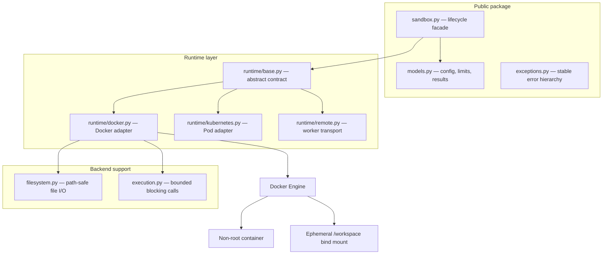
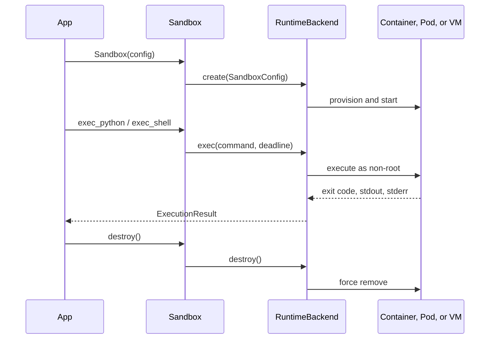

# Architecture

AgentNest separates the developer API from the isolation mechanism. The high-level package knows
about sandbox lifecycle, execution results, files, and deadlines; it does not know about Docker
containers. This boundary is the main extensibility mechanism.

## Components

`Sandbox` accepts either a backend name or a `RuntimeBackend` instance. Dependency injection keeps
unit tests daemon-free and lets downstream applications prototype custom backends without forking
the public API.

## Lifecycle

The total-lifetime timer starts only after successful creation. Each execution is capped by the
smaller of its requested timeout and the remaining sandbox lifetime. If the blocking backend call
exceeds that deadline, AgentNest removes the whole environment before raising
`ExecutionTimeoutError`. Destruction is idempotent.

## Docker backend

Each `DockerRuntime` owns exactly one container and one host temporary directory. The directory is
the only host path mounted into the container, at `/workspace`. The root filesystem is read-only by
default; restricted tmpfs mounts provide ephemeral scratch space. Captured `exec` output is retained
by the backend because Docker does not include exec output in the container log stream.

The fixed UID avoids image-specific root users. It also means images must provide a POSIX shell and,
for `exec_python`, a `python` executable. `python:*` images satisfy both requirements. Custom runtime
images should follow the same contract.

## Adding a backend

Implement all methods on `RuntimeBackend`:

1. `create` translates `SandboxConfig` into an isolated environment.
2. `exec` returns an `ExecutionResult` and enforces its supplied timeout.
3. `write_file` and `read_file` address relative workspace paths.
4. `logs` returns accumulated process output.
5. `destroy` is safe to call repeatedly and removes every owned resource.

Publish a factory through the `agentnest.backends` entry-point group or register it with
`RuntimeRegistry`. No other public API changes are required. A backend should map infrastructure
failures into AgentNest exceptions and document guarantees weaker than the Docker defaults.

## Capability interfaces

Streaming and snapshots are optional, runtime-checkable protocols. Policies, events, approvals,
secrets, pools, templates, and artifacts remain backend-neutral. This prevents specialized features
from expanding the minimum runtime contract.

## Included integration surfaces

- gVisor and Kata through Docker OCI runtime selection
- Kubernetes Pods and NetworkPolicy
- versioned remote execution API and Firecracker worker transport
- browser and GPU presets
- MCP tools, CLI, YAML profiles, snapshots, artifacts, and warm pools

AgentNest intentionally does not implement a cluster scheduler, image registry, network overlay, or
Firecracker lifecycle daemon. It composes with that infrastructure through narrow adapters.
