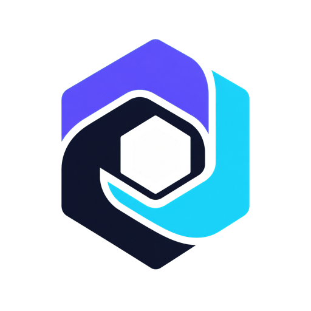
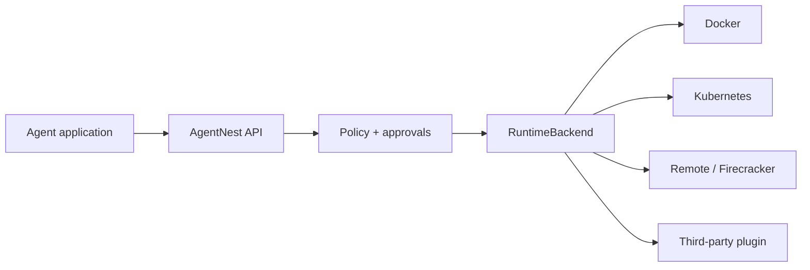

<div class="hero">
  <div>
    <h1>Run agent code.<br>Contain the risk.</h1>
    <p>AgentNest is the open-source, self-hosted runtime for isolated AI agent execution. Give agents Python, shell, files, packages, browsers, and GPUs without giving them your host.</p>
    <p><a class="md-button md-button--primary" href="quickstart/">Start building</a> <a class="md-button" href="https://github.com/mihirahuja1/agentnestOSS">View on GitHub</a></p>
  </div>
  
</div>

```python
from agentnest import Sandbox

with Sandbox("python:3.12-slim", timeout=60) as sandbox:
    sandbox.write_file("main.py", "print('Hello from isolation')")
    result = sandbox.exec_shell("python main.py")
    print(result.stdout)
```

<div class="feature-grid">
  <div class="feature-card"><h3>Secure by default</h3><p>Non-root execution, no capabilities, read-only roots, resource limits, denied networking, and hard cleanup.</p></div>
  <div class="feature-card"><h3>One API, many runtimes</h3><p>Docker today, with gVisor, Kata, Kubernetes, Firecracker workers, and third-party plugins behind one contract.</p></div>
  <div class="feature-card"><h3>Built for agents</h3><p>Streaming, async, secrets, approvals, snapshots, pools, artifacts, MCP, browsers, GPUs, and Git workspaces.</p></div>
</div>

## The runtime boundary

AgentNest is not a cloud platform and does not replace your orchestrator. It is a focused execution
layer that translates a developer-friendly Python API into hardened infrastructure primitives.



!!! warning "Know your isolation boundary"
    Ordinary containers share the host kernel. For hostile multi-tenant workloads, use the gVisor,
    Kata, Kubernetes RuntimeClass, or Firecracker worker paths and apply defense in depth. Read the
    [security model](security.md) before production deployment.

## What ships in 0.2

- synchronous and asynchronous Python, shell, and argv execution
- incremental stdout/stderr streaming with output limits
- race-safe workspace files, uploads, downloads, artifacts, and snapshots
- immutable security policies, secret redaction, approval hooks, and audit events
- deterministic templates and bounded warm sandbox pools
- Docker, gVisor, Kata, Kubernetes, remote, and Firecracker integration surfaces
- browser and GPU presets, Git helpers, MCP tools, CLI, and authenticated API server
- plugin discovery through the `agentnest.backends` Python entry-point group
